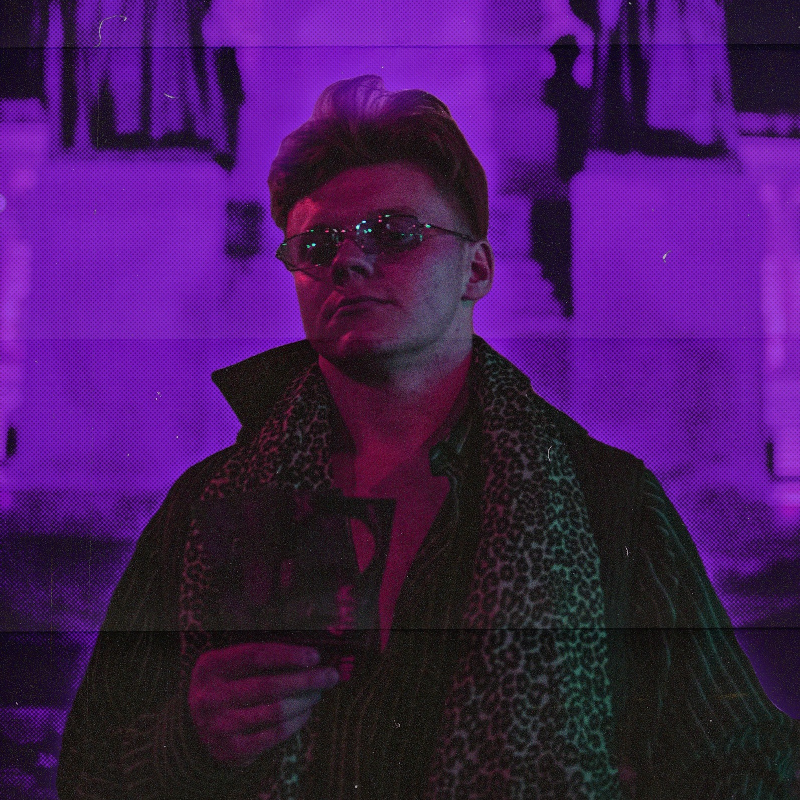

# Fist Impression
That is not a typo. My designs are going to punch you like a fist.

## About me
My name is Petr and I am Prague based UX/UI designer. However, that is not how I began my journey.

I started as a junior graphic designer in a marketing agency TRITON IT, where I put hand on creating brand identities, business cards, flyers, brochures and billboards. But what I found most amusing were websites. And that is how i got into User Interface Design and User Experience.

Now I work for the biggest and most profitable Czech telecommunications provider O2 and the rest is history (described in this portfolio). My role is to expand MojeO2 (O2 selfcare platform) design system, create in-app ad banners for products and services and draw wireframes for new product deliveries.

## My work

### Insurance Calculator

**Client need**

Create simple calculator for agricultural customers to find out the cost of insurance

**Tasks to do**

Branding

Website (User flow, Wireframes, UI)
