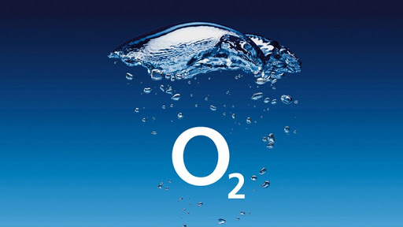
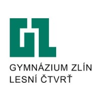

# My Experience

## Work related experience

## UX/UI Designer

**O2 Czech Republic**

**Q3/2022-present**

I work as a User Experience and User Interface designer. My role is to expand MojeO2 (O2 selfcare platform) design system, create in-app ad banners for products and services and draw wireframes for new product deliveries.

## Graphic Designer

**TRITON IT**

**Q1/2021-Q3/2023**

I started my career here in TRITON IT, where I put hand on creating brand identities, business cards, flyers, brochures and billboards. But what I found most amusing were websites and that's what got me into UX/UI.

## School related experience

## University of Creative Communications

**Prague**

**Q4/2020-present**

I got into design as I fully started studying at this school. It was a life changing moment.

## Gymnázium Zlín - Lesní čtvrť

**Zlín**

**Q3/2014-Q2/2018**

I got into design as I fully started studying at this school. It was a life changing moment.

