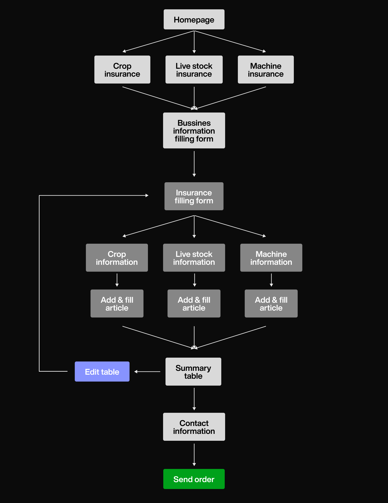
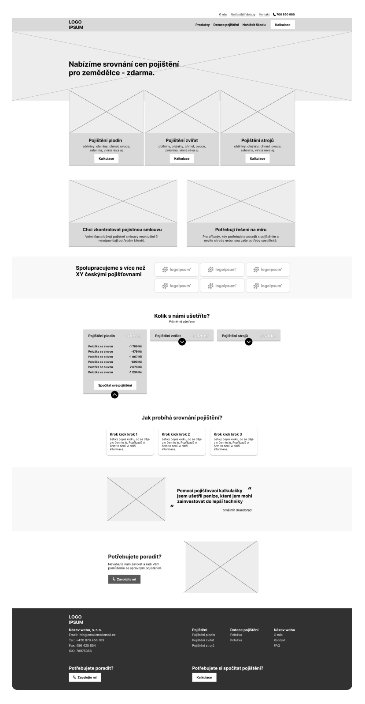
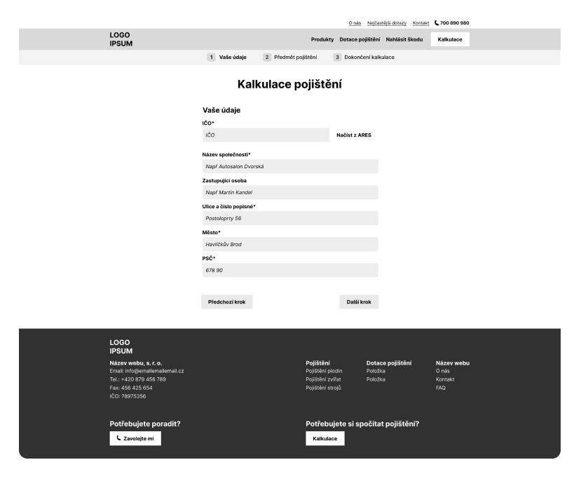
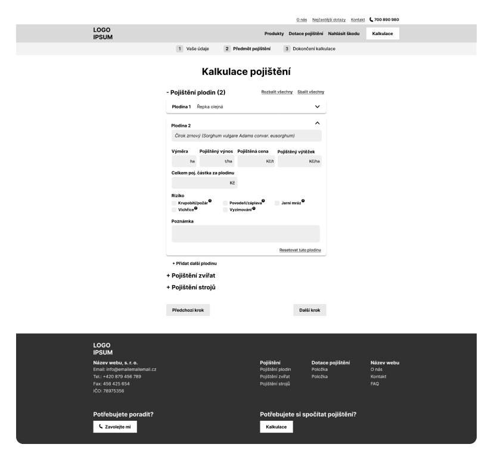
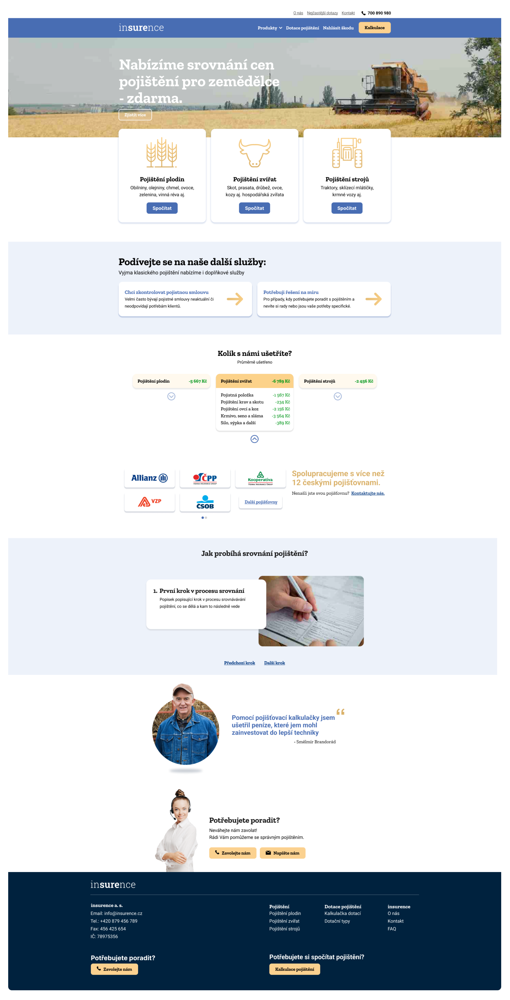
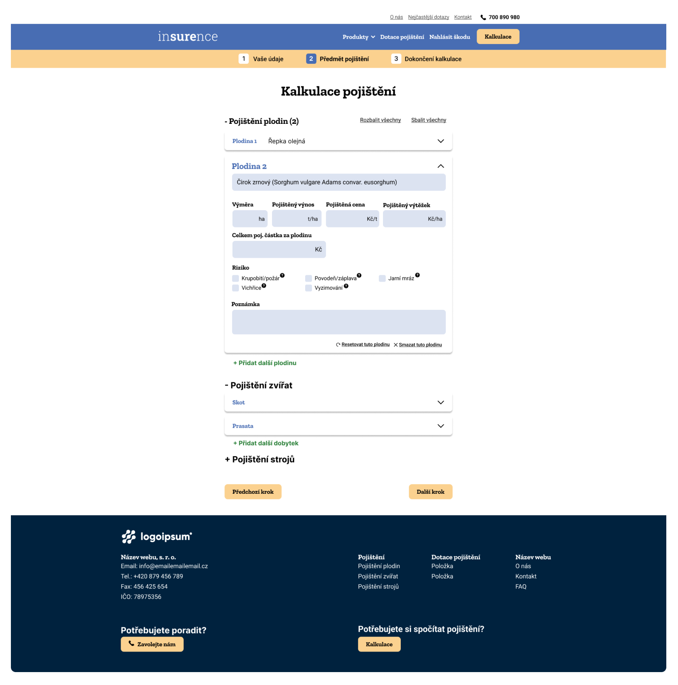
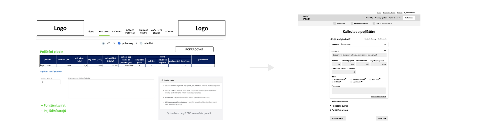

# Insurance Calculator

## Client need

Create simple calculator for agricultural customers to find out the cost of insurance

## Tasks to do

Research

Branding

Website (User flow, Wireframes, UI)

### Research

Find other sites comparing insurances

To avoid similarity in design

To get inspiration

### User Flow

### Wirefeames

The aim of wireframes is to think through individual sections of the website. 

Down here you can see how I draw these sections.

Homepage Wireframe

Personal Information Filling Form Wireframe

Crop, Stock and Machinery Filling Form Wireframe

### Final Design

Homepage UI

Crop, Stock and Machinery Filling Form UI

### Obstacles

Since beginning I have been consulting possibilites with developers to prevent errors.

One obstacle occured - development limitation.

Because of easier responsive coding, a narrow layout grid had been chosen.

That limited designing space - First idea was to have big fillable table That was impossible to nest into the layout, so we have chosen to design tab group for each category with text fields spaced vertically.

## Summary

The Insurance Calculator was one of my most amusing projects as I had to create the user journey, wireframes and whole design. 

During this project I finally realized, that the UX design is the field I want to educate myself in.

However, this had never been realised because the client haven’t find sufficient amount of funds to finance this project.
