Welcome to the presentation of my one and only bachelors thesis.

And here's the link for completeness: https://www.figma.com/file/rSfhY2hVfhXAYe8HcGNFXA/Untitled?type=design&node-id=0-1

# Have you ever...
...been in a situation, when you travel abroad and have all your needs covered? Shopping, groceries, taxi, accomodation. All of these subjects can be easily covered via multiple and various apps, websites or even complex-service providers.  

But what if you need a doctor? What if you have a health problem and you need to tackle it as soon as possible? Surely, you can visit any hospital, but you’ll have to wait a unneccessary period of time to finaly tell the doc your health issue. What if you could visit a website, that enables you to book an appointment to a specific healthcare practitioner with a specific time dedicated to you?  

For that reason there is  Nomæd - Medical care for expats and nomads (or travelers in general).
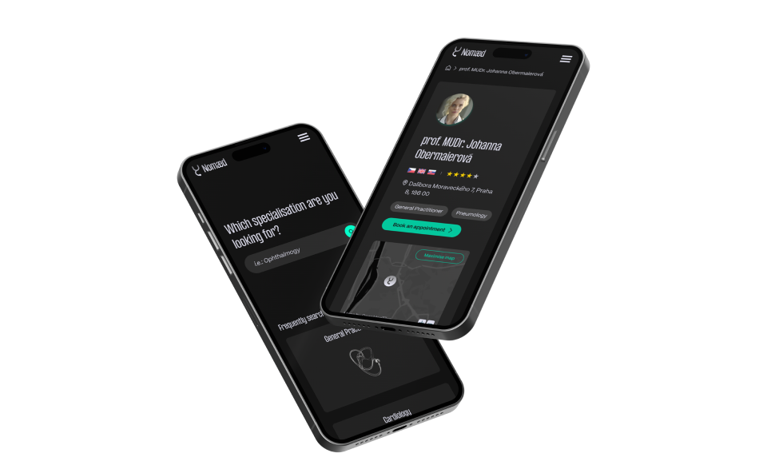

# Don’t get mad – Get Nomæd

With Nomæd, healthcare is close at hand. We collaborate with thousands of doctors across the world in 30 countries and the variety of specialisations spans over 70 different kinds.  

But how did we started? With Petr’s bachelors thesis project.
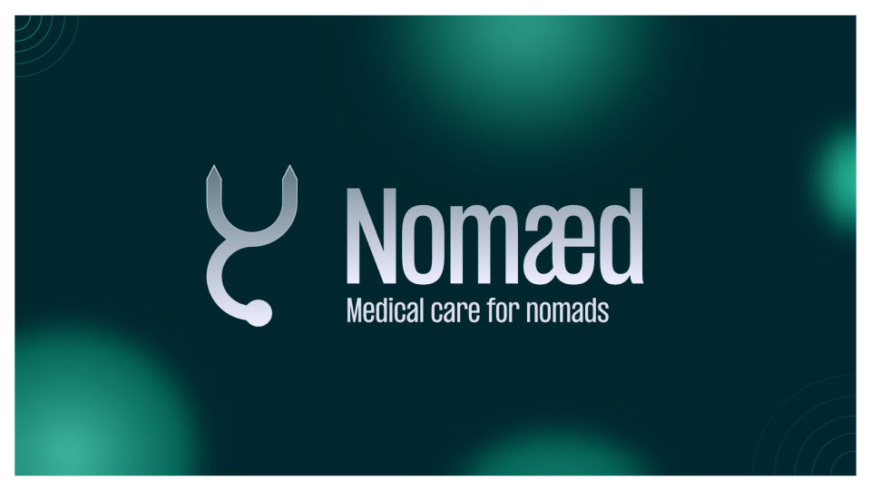

# The birth of an idea
When I was in UK back in 2019, I was struggling to buy specific goods – toothbrush, kitchen appliance, etc. That is when I got an idea to create an app, that will help you find those needed goods.  

However, when I finally got to building up my thesis, I started thinking about this topic more thoroughly and realized, many of these problems can be easily solved by Google Shopping. So I basically had a bachelors thesis about a digital product, that had no target group and no use whatsoever. At that time, I started thinking about other fields that haven’t been covered and I came to realisation, that online healhcare booking possibilities were completel neglected. And since then, the idea started inflating with a hope, that it might be a needed service.

# Phase I – User Research
At the beginning of my thesis, I was planning on making a proper research to find my potential users needs. So I joined several Facebook groups that gather expats and nomads living in Czech Republic and posted a attractive picture asking for a participation in my face-to-face interviews.  
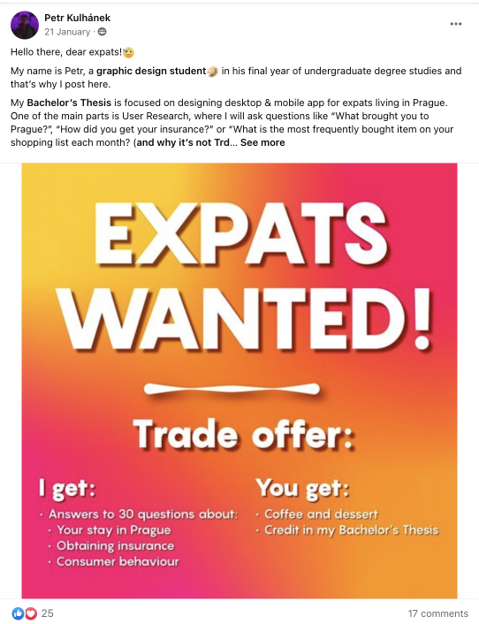
I managed to get in touch with 3 respondets who answered my questions and I could have started works on wireframes, user interface and branding, alongside with marketing, data sources and technical support of the website.

# Phase II – Branding
## Logosymbol
As I knew this subject was combining two topics – nomads and healthcare – I wanted to combine symbols that could represent such a service.  

I made a logosymbol that combines a stethoscope with a shuffle symbol. Stethocope refers to doctors, shuffle to nomads as they suffle between places and countries.

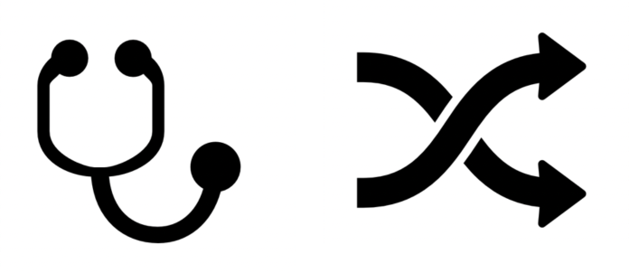
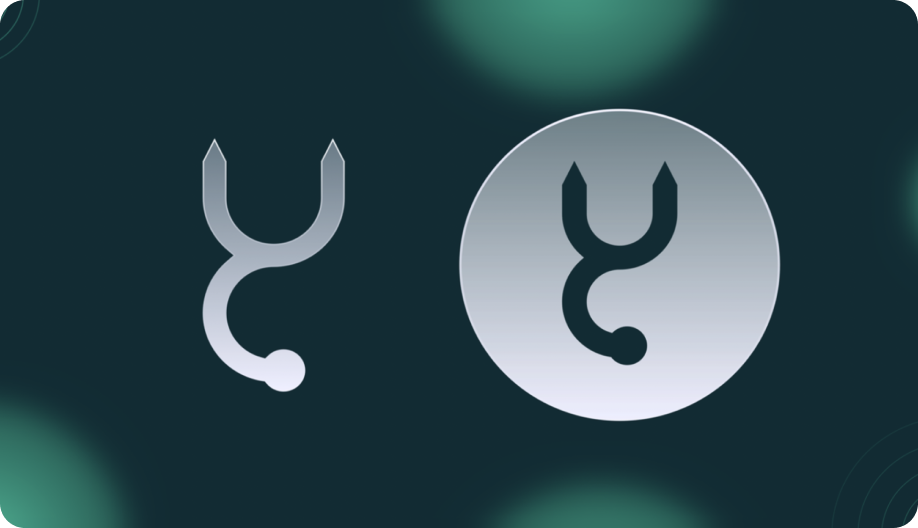

The symbol is filled with a withering gradient, that has lower opacity fill and full opacity stroke at the top.

## Logo
The final logo is a combination of aforelisted logosymbol and condensed typeface PP Formula created by Pangram Pangram Type Foundry.  

It also contains a non-mandatory tagline.

## Colours
Down below, you can find selected colours for branding.  

I have chosen greenish turqoise colour, that is inspired by doctors clothes they wear during surgeries. It is also a colour that is usally associated with doctors.  

I didn’t want this website to look as a typical healthcare product, so I also went for darker background that makes Doc Turqoise stand out. Instead of white, I used so called Icy Chalk as it isn’t as bright as regular white and on a dark background it is much more plausible for eyes to read.

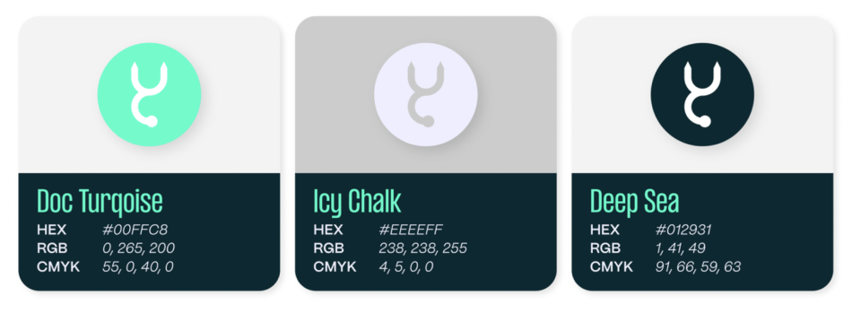

## Illustrations
All illutrations, that have been used in my thesis, have been generated by artificial inteligence – Midjourney.  

These illustration were inspired by x-ray scannings of organs and bones and also by hand-drawn sketches.  

I used prompt: 
organ or tool], x-ray, white outline stroke, sketch, black background - - v5, - - q2, - - s 250

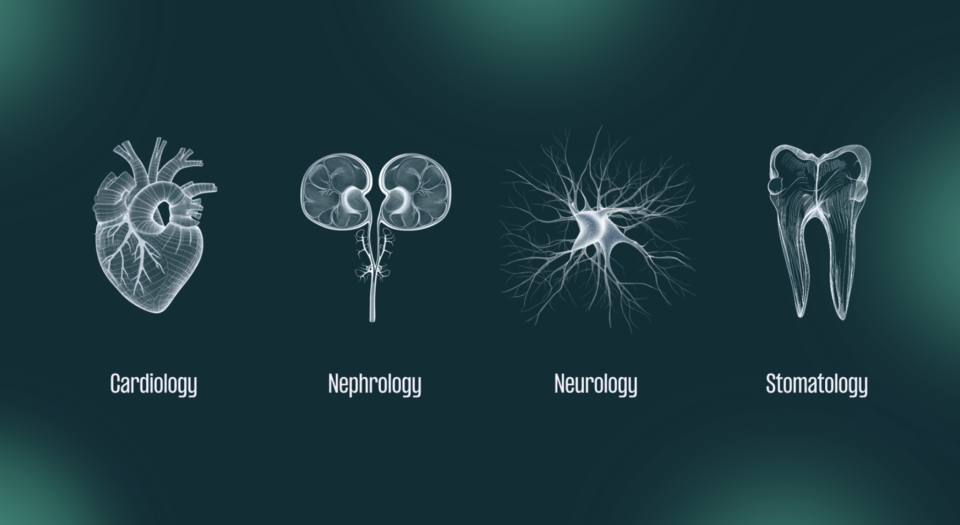

## Marketing
As this product would need to get into the heads of potential customers, I had to create also banners for marketing purposes.
These banners were made for Google Ads and social media ads.

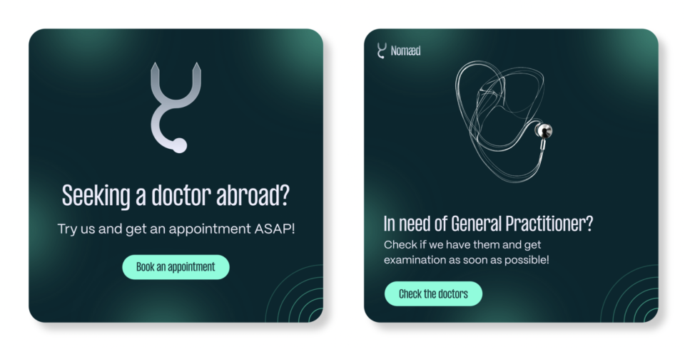
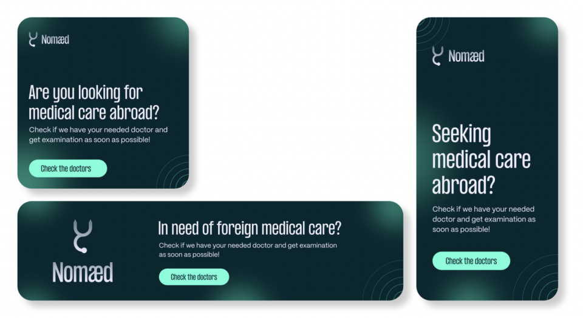

## Business card
As I would be the CEO, I made myself a business card too.

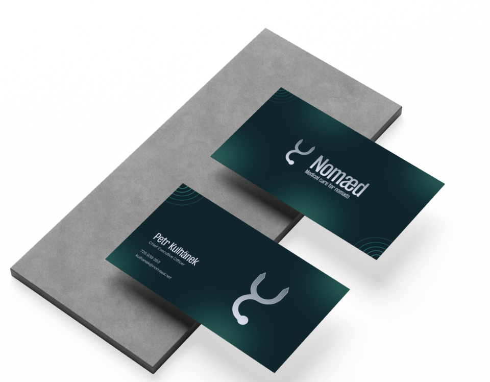

# Phase II – User Interface
## Homepage
As a first page I started with wireframing homepage that I then converted into the real design based on my design system that I have been working on to make my job easier when building other pages.  

The website consists of: 
Menu 
Search bar 
Quick picks 
Numbers about website 
FAQ 
Leading point 
Footer 

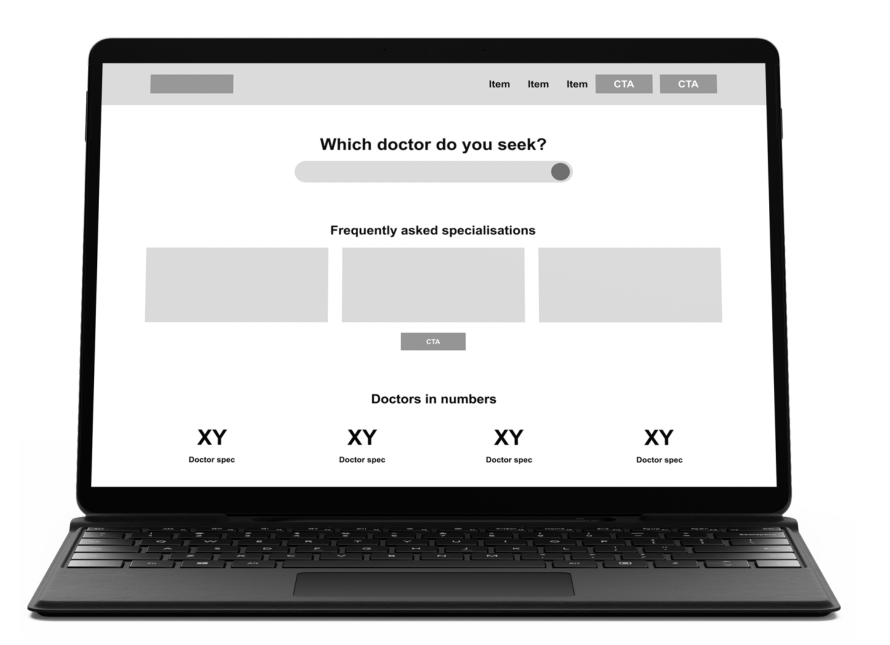
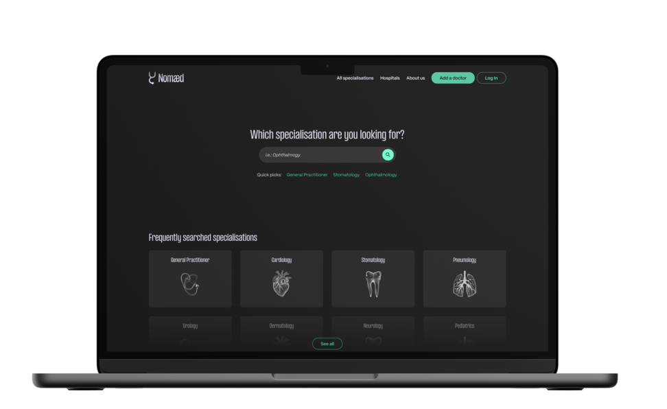

## Search bar
Inspired by Airbnb’s search bar, the default state is pretty simple with only one input and search button. As the user clicks in, a m ore complex option enroll enabling him to make a more detailed search.

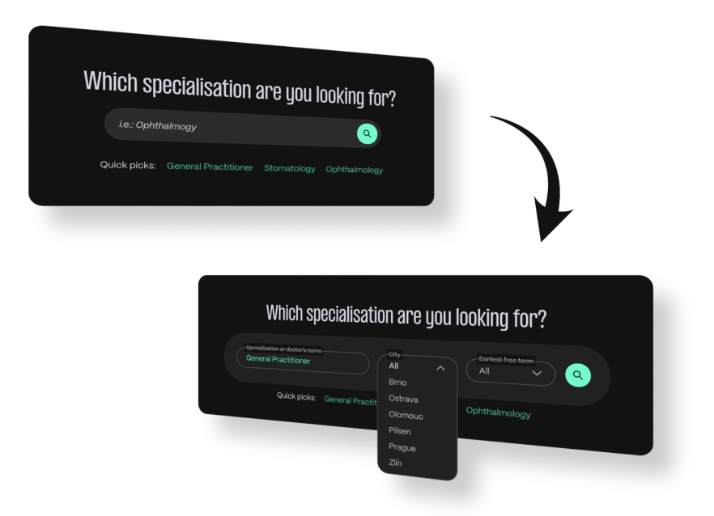

## Doctor page
The most important page is the page of a doctor, where a potenital pacient can book an appoitnment.

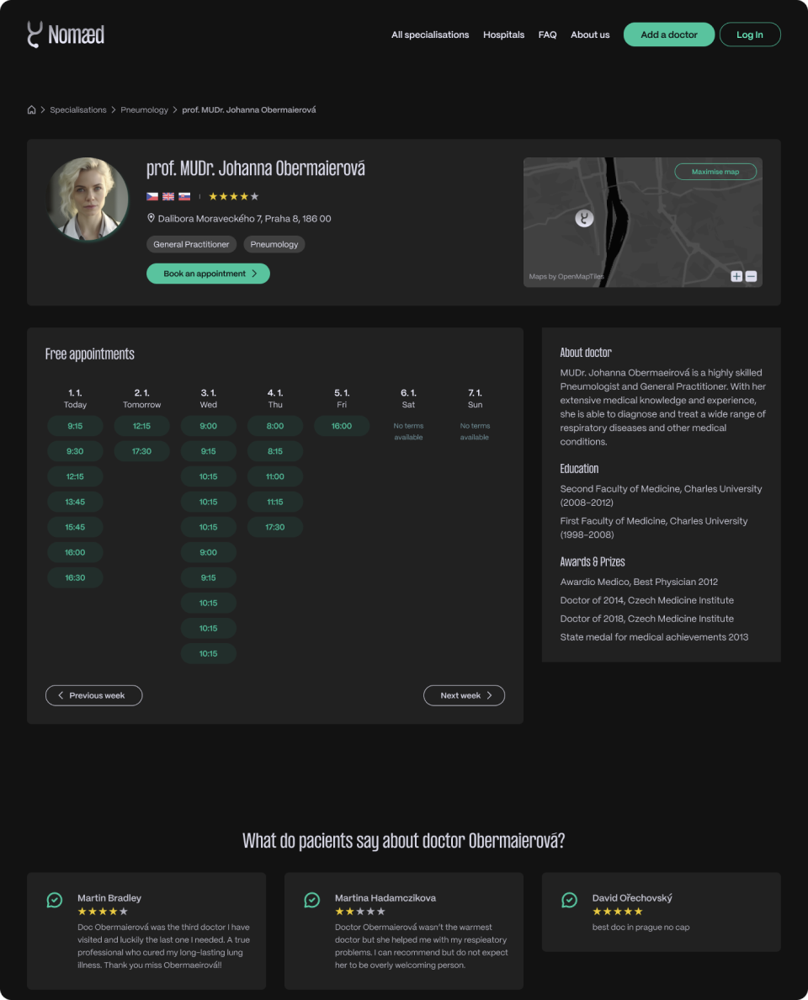

## Booking form
As the user clicks on specific time, a modal window appears. In that window, he fills all neded inputs and can easily book an appointment.

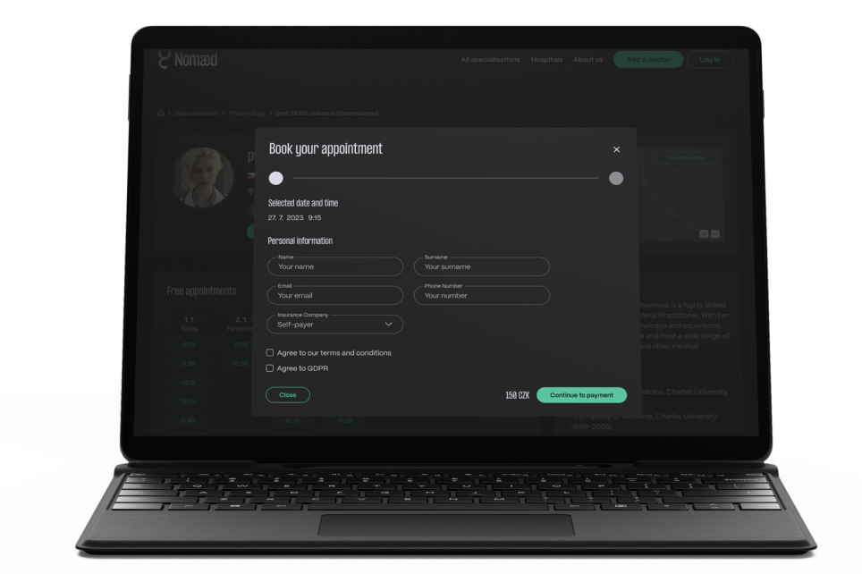

# Summary
During the works on my bachelors thesis, I found new ways to create a design system and how to use it properly during your job.

I made some great findings about foreigners in Czech Republic, got in touch in 3 of them and gathered very interesting info about insurance, migratory policy and how they feel in Czechia.

I also made myself sure, that I have chosen the right field and I truly aspire to be the greatest User Interface Designer of all time. To be the GOAT 🐐.
