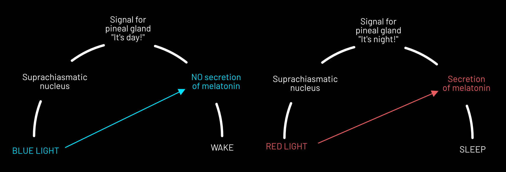

# Blue light and its effects on human beings

In this presentation, I would like to enlighten you about the topic of blue light and its effects on human beings and potential aftermaths if you don’t have proper blue light hygiene.

If you want to see my in-class presentation visit this link: <https://www.figma.com/file/moCjprfUyLJO7C4SI9QIpY/Storytelling?type=design&node-id=0-1>

# Prehistoric John

To demonstrate this correctly, please, meet John.

 

John is prehistoric caveman, who spends his days running through landscapes, hunting deers, chilling by the only nocturnal source of light – fire, and then he falls asleep to it.

# Nowadays John

If our protagonist lived in 2023, he would wake up and take a triple shot flat white, as he wants to restrict any leftover adenosine from reaaching adenosine receptors in his brain. 

Then he spends 8 hours sitting behind his office desk with absolutely no stretching.

Then he comes home, spends the rest of his day gazing into his phone consuming social media content. Eventually, he falls asleep after totally smashing his brain with the full brightness emitted from his mobile device.

# What is John doing wrong?

Everything. But mostly, he does not have a proper blue light hygiene. But to understand more, let’s introduce you into brief definition of blue light.

# Caeruleus lux et populus
(or Blue light and its effects on human beings)
## Blue light

Blue light is a part of visible light.

## Visible light

Visible light is a light visible to human eye. And that light is part of electromagnetic spectrum.

## Blue and green light

The most important part of visible light is green and blue light, that is detected by suprachiasmatic nucleuses.

These are nucleuses located in the hypothalamus. As it detects blue light, it gives the signal to the brain, that it is a day and such gland stops the secretion of melatonin – the hormone, that tells the body, that it is time to go to bed.

Melatonin therefore works as a referee who shoots the gun for runners to start running – in this case, the body to start shutting down.

Apart from that, alongside with suprachiasmatic nucleuses, it synchronizes body’s sleep-wake cycle.

## Sleep-wake cycle

The sleep-wake cycle determines levels of bodily energy, alertness and other body functions in general.

Down here you can see comparison between the blue light and red light.

Red light is a friend of suprachiasmatic nucleuses, it gives no signal to brain and the absence of blue light suggests, that body can start to fall asleep.

# What does it all mean?

It means that you should:
Avoid blue light during late night hours, if you want your body to rest properly during sleep and do not wish to have disturbed circadian rhythm AKA sleep-wake cycle.

However, you should’t avoid during early hours after waking up as it: 
- Supports cognitive functions 
- Make you more alerted during the day 
- Gives signals to wake the body 
